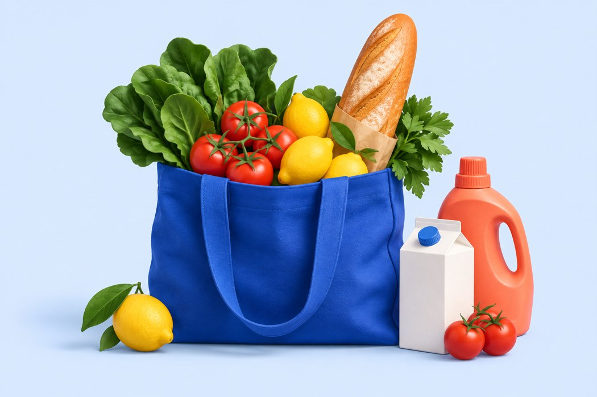

# Our Weekly Shop
## A little less to think about
Research and redesign rationale | 8 September 2026
Prepared for Jack and the Our Weekly Shop team

### The recommendation
Build a calm, useful weekly ritual around four clear destinations: **Home, Plan, Meals and Basket**. Give people an immediate next action, a readable week, familiar favourites and a safe way to reuse their work. The visual direction is bright cobalt, sky blue, coral and white, with generous typography and original grocery imagery.

The strongest evidence supports reducing cognitive effort and making navigation recognisable. It does **not** establish a colour theme that will acquire the most parents. The new palette is a deliberate brand hypothesis; its effect must be tested with the intended audience. [Colour review, 2014](https://www.annualreviews.org/content/journals/10.1146/annurev-psych-010213-115035)

### Product promise
Prepare the whole household's online shop: meals, food, cleaning, toiletries, pets and other essentials. Subtract what is already at home. The eventual service should compare complete supermarket baskets, review suitable product matches and transfer an approved basket for checkout on the retailer's website.

**Available today:** planning, reusable meals, regular items, cupboard quantities, basket requirements and account/device saving. **Still unavailable:** real supermarket totals and automatic transfer. Sample prices cannot support a cheapest-store claim or place an order.

### Scope and method
This review combines primary research, platform guidance, usability research and seven relevant product references. Public product pages and available app screenshots were reviewed; this was not a logged-in test of every competitor. Assumptions: UK households, frequent phone use, varied digital confidence and a weekly rather than daily task. Research is current to 8 September 2026. No target-user trial, acquisition experiment or project retention baseline was supplied.

<!-- PAGE -->
## 01 / What the evidence supports
### Reduce the remembering and deciding
A study of 3,000 US parents identified different patterns of core and episodic cognitive household labour. Mothers reported more of the recurring core work. This supports designing around planning and remembering, with care about generalising a US sample to UK households. It was not an app experiment. **Design inference:** remember recipes, quantities and preferences; reuse a week; show what remains to do. [Weeks & Ruppanner, first published 12 December 2024](https://onlinelibrary.wiley.com/doi/10.1111/jomf.13057)

### Make destinations visible and predictable
Android guidance describes a navigation bar for three to five destinations of equal importance, kept consistent across screens. Apple distinguishes tab navigation from actions. **Decision:** four labelled destinations; “Add” stays an action within the relevant screen. Home is the starting point, Plan the calendar, Meals the recipe collection and Basket the combined requirements. [Android navigation bar](https://developer.android.com/develop/ui/compose/components/navigation-bar) | [Apple tab bars](https://developer.apple.com/design/human-interface-guidelines/tab-bars)

### Explain things at the moment of need
Progressive disclosure helps keep advanced options from overwhelming new users. Contextual help can be more useful than an interrupting tutorial that people forget. **Decision:** Gemma offers a brief explanation beside the current task; less common controls sit in clearly named options. Core meals and basket navigation stay visible. The short existing welcome remains skippable. [NN/g: Progressive Disclosure, 2006](https://www.nngroup.com/articles/progressive-disclosure/) | [Contextual Help, 2023](https://www.nngroup.com/articles/onboarding-tutorials/)

### Distinctive can still feel familiar
Two experiments found that lower visual complexity and greater familiarity influenced initial aesthetic ratings of website screenshots. This concerns first impressions, not parent acquisition or long-term grocery use. **Decision:** a distinctive colour and illustration system within recognisable cards, buttons, forms and tabs. [Tuch et al., 2012](https://research.google/pubs/the-role-of-visual-complexity-and-prototypicality-regarding-first-impression-of-websites-working-towards-understanding-aesthetic-judgments/)

### What the evidence cannot tell us
No reviewed source establishes “blue converts mums best”, a universal parent theme, or a retention increase for this app. Product marketing and high ratings do not isolate the effect of design. The recommendation is strongest on clarity and effort reduction; palette, tone and imagery need audience testing.

<!-- PAGE -->
## 02 / What to learn from other apps
These are relevant design references, not a verified top-seven ranking. Features below come from the products' own pages. They show useful patterns; they do not independently prove why an app succeeded.

| Reference | Useful pattern | Application to Our Weekly Shop |
| --- | --- | --- |
| Mealime | Meal choice leads to an organised ingredient list; food imagery makes selection concrete. | Meal choices automatically contribute ingredients; clear meal cards and portions. |
| Samsung Food | A visible planner, saved recipes and reusable multi-day plans. | A weekly board, direct day editing, persistent planning position and next-week reuse. |
| Cozi | Shared household context and a meal plan connected to the week. | Make who is eating explicit and keep the household visible. Live collaborative editing is a separate future feature. |
| Sorted Sidekick | Recipe groups use overlapping ingredients. | Preserve ingredient overlap suggestions; explain why a suggestion fits instead of presenting an unexplained recommendation. |
| Bring! | Visual item choice, templates and recipes that feed a list. | Retain multi-item quick add and categories covering the whole household. |
| Huckleberry | Reassuring language, clear next actions and lightweight everyday input. | Small, understandable decisions and a warm helper. Avoid turning a general family product into a baby-tracking aesthetic. |
| Peanut | A confident, distinctive identity and one clear public-page call to action. | A strong hero, short promise and clear starting button. Avoid a social feed or infinite content in a weekly utility. |

Sources: [Mealime](https://www.mealime.com/) · [Samsung Food](https://support.samsungfood.com/hc/en-us/articles/35369657798548-Getting-Started-with-Meal-Planner) · [Cozi](https://www.cozi.com/meals-and-recipe-box/) · [Sidekick](https://www.sortedfood.com/sidekick) · [Bring!](https://www.getbring.com/en/features/inspired) · [Huckleberry](https://huckleberrycare.com/) · [Peanut](https://www.peanut-app.io/). Public visual inspection included Mealime, Huckleberry and Peanut; other references use product documentation and available product imagery.

### A material change in the market
Mealime's official notice says it will discontinue on **21 October 2026**, with recipes and tools moving to Meals Hub in Albertsons store apps. It remains a useful workflow reference as of this review, but should not be recommended as a lasting standalone service. This does not establish a design-related reason for its closure. [Official closure notice](https://www.mealime.com/closing)

### Blend behaviours, not branding
Use familiar meals, remembered household items and fewer repeated choices. Keep Our Weekly Shop's distinct purpose: preparing a complete online basket across retailers. Do not copy competitors' layouts or imply their account, sharing or checkout integrations exist here.

<!-- PAGE -->
## 03 / A navigation plan people can explain
### Four destinations, always in the same place
| Destination | The question it answers | Main action |
| --- | --- | --- |
| Home | Where am I up to? | Continue my weekly shop |
| Plan | What are we eating this week? | Choose a meal or edit a day |
| Meals | Where are our reliable favourites? | Find, save or reuse a meal |
| Basket | What does the whole household need? | Check quantities and preferences |

The Plan workspace also has four labelled stages: **Meals → Other things → At home → Basket**. These describe the task sequence, while the bottom destinations remain stable. People can move between stages; they do not have to fill every meal or complete every cupboard check.

### First visit
The Home promise explains meals plus everyday essentials. Start with a first name for portions, then choose a meal, who will eat it and the days. Food and household items can also be added without planning meals. No account is required to begin; the saving message explains whether work is on the device or in an account.

### Returning during the week
Home gives one continuation action and an overview of meals, other items and basket requirements. Plan remembers the day and calendar view previously used for that week. The whole-week board makes blank slots visible and lets people add a meal directly. Meals places favourites first, with search and meal-type filters.

### Starting the next shop
“Use this plan next week” copies meals and extras after a plain-language confirmation. Cupboard checks start fresh and regular items follow their schedule. If next week already exists, it opens intact. The original week remains saved. This is a useful repeat-use mechanism without inventing a daily reason to visit.

### Completing the basket
Ingredients, extras and regular items combine; existing stock is subtracted. Rows say **Need** because a recipe requirement such as half a pack is not a purchasable supermarket pack. Brands and notes remain visible. Real pack matching, full costs and transfer must be clearly reviewed when the retailer integration is built.

### Keep the promise understandable
The comparison example remains explicitly labelled as made-up prices. The working planning tool must never suggest that a retailer is connected, a basket has been sent or an order placed when that has not happened.

<!-- PAGE -->
## 04 / The new visual language
### Bright, capable and welcoming
The redesigned app moves to a blue-and-white foundation with coral and butter-yellow highlights. Original grocery artwork includes food and a cleaning product, signalling that this covers the entire household shop. Food photos help with meal choice; abstract meal placeholders remain clearly generic.

| Role | Colour | Use |
| --- | --- | --- |
| Primary action | Cobalt #3155D9 | Main buttons, active navigation, links |
| Foundation | White #FFFFFF / cool #F4F7FC | Cards and page surfaces |
| Headings | Navy #19377B | Bold, readable hierarchy |
| Supporting surface | Sky #DDEBFF | Hero and cupboard guidance |
| Warm accent | Coral #FF8264 / pale #FFE7DF | Artwork and repeat-week panel |
| Secondary accent | Butter #FFF0BF | Quick add and helpful suggestions |

**Design judgement:** this combination is distinctive, energetic and avoids assigning a stereotyped “mum colour”. Colour psychology research calls for attention to context and limits on generalisation; it cannot validate an acquisition claim for this palette. [Elliot & Maier, 2014](https://www.annualreviews.org/content/journals/10.1146/annurev-psych-010213-115035)

### Readability before decoration
Use bold headings, short explanations, generous spacing and large labelled controls. The main action should be easy to identify without interpreting an icon. Primary buttons use white text on cobalt; body text uses dark ink on light surfaces. Icons support text instead of replacing it. Focus and selected states need more than a subtle colour change.

### Responsive structure
Desktop gains a wider canvas, a split hero and a two-column weekly board. Small screens stack the content, keep four labelled destinations and use large meal slots. This avoids treating the desktop as an enlarged narrow phone screen. [NN/g: Mobile First Is NOT Mobile Only, 2016](https://www.nngroup.com/articles/mobile-first-not-mobile-only/)

### Motion and access
Short page transitions and Gemma's small movement provide continuity. Reduced-motion preferences disable nonessential movement; animations never block task completion. Main buttons are at least 48 pixels high, usually 54. WCAG 2.2's AA target-size criterion is 24 CSS pixels with exceptions; the larger design target is deliberate, not a claim that WCAG requires 48. This redesign is not a full accessibility certification. [W3C target size](https://www.w3.org/WAI/WCAG22/Understanding/target-size-minimum.html) | [W3C animation](https://www.w3.org/WAI/WCAG22/Understanding/animation-from-interactions.html)

<!-- PAGE -->
## 05 / Return because it helps
### Optimise for a finished weekly job
Repeat use should come from saved effort: a familiar plan, reliable quantities and the confidence that nothing important was forgotten. More taps, longer sessions or a daily streak are poor standalone goals for a weekly shopping utility.

Duolingo reported a **3.3% relative increase in Day-14 retention** in an experiment that reduced the effort needed to maintain a streak. This was a first-party language-learning experiment, with trade-offs in daily-goal completion. It is not evidence of a grocery retention lift. The transferable hypothesis is to lower the cost of making useful progress, not to import a daily streak. [Duolingo, 19 November 2020](https://blog.duolingo.com/improving-the-streak/)

### Proposed measures, not claimed results
The HEART framework helps connect product goals with user-centred signals. For this app, begin with task success and weekly return. No analytics infrastructure or new tracking has been added by this redesign. [Rodden, Hutchinson & Fu, CHI 2010](https://research.google/pubs/measuring-the-user-experience-on-a-large-scale-user-centered-metrics-for-web-applications/)

| Question | Measure to establish | Guardrail |
| --- | --- | --- |
| Can a new person use it? | Unaided completion of a meal + household-item + cupboard + basket task | Record errors and requested help, not just speed |
| Is the next shop easier? | Time and corrections when reusing a week versus starting blank | Keep original plans and protect existing next weeks |
| Do households return? | Week-2 and Week-4 planning activity among households that first completed a basket plan | Compare like cohorts; do not count passive page loads as planning |
| Is the new look clearer? | Task success, confidence and preference against the previous design | Test with varied digital confidence, household types and ages |
| Does online checkout work? | Approved transfer and retailer review completion | Measure only after genuine integrations exist |

### Practical next study
Recruit 6-8 target users for an initial formative round, including parents who describe themselves as uncomfortable with apps. Ask them to plan two dinners for different eaters, add milk and toothpaste, subtract some stock, find a favourite, return to a saved day and reuse a week. Let them explain what they expect to happen next before clicking. Fix misunderstandings, then repeat with new participants. This small study finds usability problems; it cannot establish population conversion rates.

For marketing, test two honest benefits: “Your week. A little easier.” and “Meals and everything else. One weekly basket.” Keep audience, offer and traffic comparable. Choose success measures and sample requirements before an acquisition experiment; do not declare a winner from a few preferences.

<!-- PAGE -->
## 06 / Delivery, limits and next priorities
### Implemented in this redesign
A new blue, sky, coral and white visual system; original grocery hero artwork; a new Home dashboard; four fixed labelled destinations; a responsive weekly meal board; favourites placed first; a prominent next-week reuse action; remembered planning day and view; clearer basket requirement wording; and restyled guidance, forms and secondary screens.

The existing household model, portion calculations, ingredient aggregation, regular items, cupboard subtraction, brand requirements, device/account saving and sample matching remain the functional foundation. The new reuse path resets week-specific checks and protects any existing destination week.

### Verification approach
Automated checks cover the existing basket and saving rules plus new reuse protection, source preservation and saved planning position. JavaScript parsing, type checking and the Expo web export check build integrity. Release verification also needs direct inspection of the deployed app and the retained household fixture. Test results and deployment status belong with the release record; research evidence alone does not verify software behaviour.

### What still limits the product
Real retailer integrations remain the biggest gap between the product's intended promise and its current capability. A full solution needs authorised catalogue and price access, location and slot eligibility, complete basket pricing including fees, loyalty treatment, unavailable-item handling, product/pack/brand review, actual basket transfer and a clear retailer checkout handoff. A new design cannot substitute for these capabilities.

No live collaboration, voice assistant or automated purchasing is introduced here. Gemma's visible guidance explains the task; it should not imply she has abilities that have not been built. Account saving should not be described as real-time household collaboration.

### Evidence quality and open questions
**Most dependable:** official navigation/accessibility guidance; the household-labour study for its stated sample; experimental first-impression research for its measured outcome. **Useful but limited:** competitor documentation, public product visuals and a first-party retention experiment in a different category. **Not established:** the best acquisition colour for UK mums, a causal relationship between any competitor theme and popularity, or a retention lift for this redesign.

The full-text PMC copy of a second household-labour paper could not be accessed because of a verification gate; it is not treated as a fully reviewed source. The original Wiley study provided sufficient direct support. Research stopped after targeted follow-ups resolved the main navigation, parent-needs, colour and retention questions; more broad app lists would not change the recommendation.

### Priority after release
First observe low-confidence users completing a real planning task. Next remove the largest points of confusion. In parallel, establish genuine supermarket data and transfer partnerships. Then measure whether households finish their next shop with less effort and return in later weeks.
